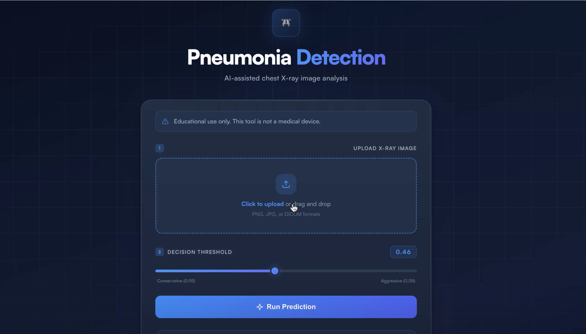

# 🫁 PulmoLens - Pneumonia Detection Tool

**[▶ Live demo](https://app.supademo.com/demo/cmmmzplt11t4q9cvjl4zaqgpy?utm_source=link)** — click through the app without installing anything.

_Pulmo_ - latin for the lungs
A web app that classifies chest X-rays as Pneumonia or Normal using a convolutional neural network (CNN),
with an adjustable decision threshold and confidence labelling.



## What it does

- Upload a chest X-ray and get a prediction with probabilities for both classes
- **Adjustable decision threshold** — set how strict the model is. Lowering it
  catches more pneumonia cases at the cost of more false alarms, which matters
  differently depending on who's using it
- **Confidence labelling** — results are marked high, medium, or low confidence
  based on how far the score sits from the threshold, so a borderline 0.51
  doesn't look identical to a confident 0.98
- Input validation: rejects non-image files and out-of-range thresholds

## Running it

```bash
git clone https://github.com/anikaahluwalia/pneumonia-detection-app.git
cd pneumonia-detection-app
pip install -r requirements.txt
python app.py
```

Then open `http://localhost:PORT`.

Model weights download automatically on first run, so the first startup is slower.

## How it works

Uploads are converted to RGB, resized to 224x224, and normalized to [0,1] —
the same preprocessing used during training. Mismatched preprocessing between
training and inference was the main bug in early versions.

The model is a CNN built in TensorFlow/Keras. Weights are hosted externally
rather than committed to the repo.

**Stack:** Python, Flask, TensorFlow/Keras, NumPy, Pillow
